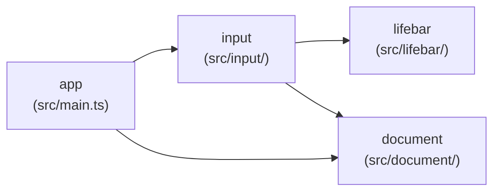

> Generated by /vibe:docs — manual edits will be overwritten; use README for hand-written content.

# Architecture

## Big picture

`lifebar-editor` is a static, backend-less site. Unlike `character`/`stage`,
there is no shared Go parsing library for the lifebar format — this app
implements its own lightweight `.def`-style parser directly in TypeScript
(roadmap decision `009`), independent from `lifebar-viewer-web`'s own
separate implementation of the same format.

- **`app`** (`src/main.ts`, `src/version.ts`, `src/style.css`) — the entry
  point. Builds the root layout (the org's shared `@openkakutou/web-ui-kit`
  app shell), mounts `input`'s view into it, and wires its load callback to
  `document`'s store.
- **`lifebar`** (`src/lifebar/`) — the format itself. `document.ts` defines
  the data model: an ordered list of sections, each an ordered list of raw
  `key = value` entries (with source line numbers), kept unevaluated rather
  than typed per known key — see "Data model" below. `parse.ts` reads
  `.def`-style text into that model, plus `sectionsNamed`/`entriesNamed`
  case-insensitive lookup helpers.
- **`input`** (`src/input/`) — the file input. `lifebar-file-input.ts` holds
  the DOM-free logic: reads a single `File` as text and calls into
  `lifebar`'s parser, returning a typed success/read-error/parse-error
  result. `lifebar-file-input-view.ts` renders the file-picker + drag-and-
  drop UI on top of that logic — a single-slot, wholesale-replace
  interaction (unlike `character-editor`'s accumulating multi-slot input),
  since this format is always exactly one file.
- **`document`** (`src/document/`) — the in-memory representation of the
  currently loaded lifebar (`lifebar-document-store.ts`): the parsed
  document plus the file name it came from. A plain module-level get/set
  store, the single place later editor screens (elements/sprite assignment,
  save/export) will read from.

## Data model

Sections and their entries are stored as **ordered arrays**, never a
`Record`/`Map` — a section name or a key can legitimately repeat in a real
lifebar file, and an array preserves both that and file order. Every
syntactically valid but unrecognized section/key is retained unchanged,
which is what makes an Ikemen GO-only extension parse successfully without
this parser needing to know about it in advance. See
`.vibe/decisions/002-lifebar-parser-data-model-and-error-scope.md` for the
full reasoning, including why this is stricter than `character`'s own
`.def`/`.cns` parsers about what counts as a parse error (no real-file
corpus evidence yet justifies the same tolerance here).

## Data flow: loading a lifebar file

1. The user picks or drops a file onto `input`'s view.
2. `input`'s logic reads it as text (via `FileReader`, not `Blob#text()` —
   the same real-browser/jsdom parity concern `character-editor`'s file
   input documents for `Blob#arrayBuffer()`) and hands it to
   `lifebar.parseLifebar`.
3. `input`'s view reports success (with the section count) or a typed
   failure (an unreadable file, or the parser's own line-numbered error)
   back to the caller — never a thrown exception at any layer.
4. On success, `app` stores the parsed document and file name into
   `document`'s in-memory store. Loading a different file later repeats
   this from step 1 and fully replaces the previous document — there is no
   accumulation across multiple files.
