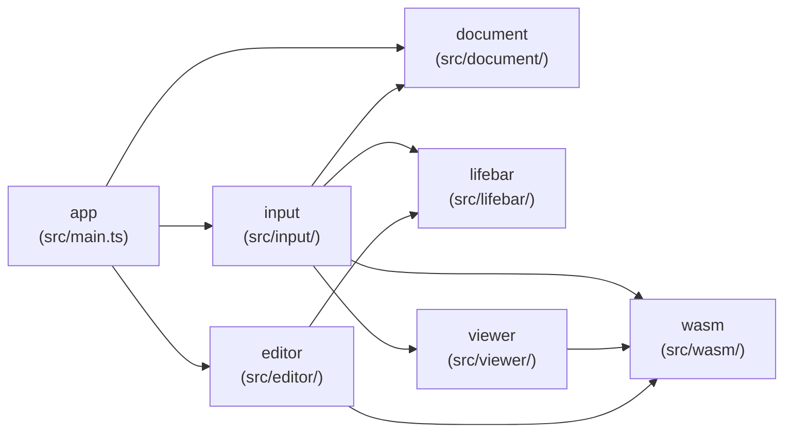
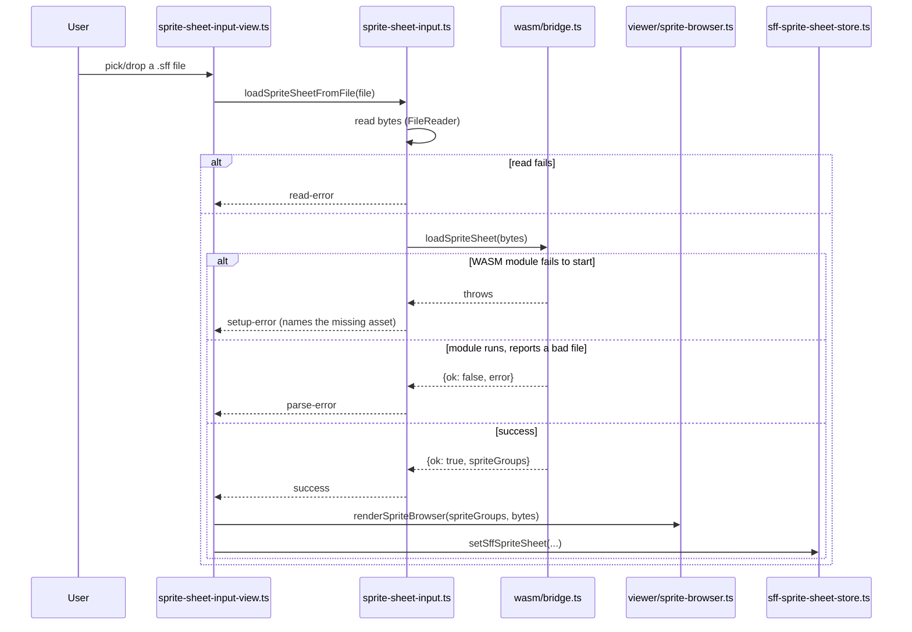

> Generated by /vibe:docs — manual edits will be overwritten; use README for hand-written content.

# Architecture

## Big picture

`lifebar-editor` is a static, backend-less site. Unlike `character`/`stage`,
there is no shared Go parsing library for the lifebar format — this app
implements its own lightweight `.def`-style parser directly in TypeScript
(roadmap decision `009`), independent from `lifebar-viewer-web`'s own
separate implementation of the same format.

- **`app`** (`src/main.ts`, `src/version.ts`, `src/style.css`) — the entry
  point. Builds the root layout (the org's shared `@openkakutou/web-ui-kit`
  app shell), mounts both of `input`'s two views into it (the lifebar file
  input and the sprite sheet input), and wires each one's load callback to
  its own store in `document`.
- **`lifebar`** (`src/lifebar/`) — the lifebar `.def`-style format itself.
  `document.ts` defines the data model: an ordered list of sections, each
  an ordered list of raw `key = value` entries (with source line numbers),
  kept unevaluated rather than typed per known key — see "Data model"
  below. `parse.ts` reads `.def`-style text into that model, plus
  `sectionsNamed`/`entriesNamed` case-insensitive lookup helpers.
- **`wasm`** (`src/wasm/`) — the bridge to the sibling `sff` library's
  WebAssembly build, which decodes `.sff` sprite sheets. `types.ts` mirrors
  `sff`'s own `Sprite`/`SpriteGroup` JSON contract; `bridge.ts` loads
  `wasm_exec.js` and `sff.wasm` (downloaded via `scripts/download-wasm.mjs`,
  `npm run wasm:download`, never committed) and exposes typed
  `loadSpriteSheet`/`resolveSpritePixels` wrappers around the
  `OpenKakutouSff` global — the same loading strategy
  `character-viewer-web` already established for its own `character` WASM
  dependency.
- **`input`** (`src/input/`) — two independent single-file inputs, same
  single-slot, wholesale-replace interaction model (never
  `character-editor`'s accumulating multi-slot one), since each format is
  always exactly one file:
  - `lifebar-file-input.ts`/`-view.ts` — reads a lifebar file as text and
    parses it via `lifebar`.
  - `sprite-sheet-input.ts`/`-view.ts` — reads a `.sff` file's bytes and
    loads it via `wasm`, distinguishing three failure causes (a read
    failure, the WASM module itself failing to start, or the module
    reporting a malformed file) rather than one generic error — see "Data
    flow: loading a sprite sheet" below.
- **`viewer`** (`src/viewer/sprite-browser.ts`) — renders a loaded sprite
  sheet's groups as a collapsible list; expanding a group batch-decodes
  every sprite it contains via `wasm.resolveSpritePixels` and shows each as
  its own thumbnail — see "Data flow: loading a sprite sheet" below and
  `.vibe/decisions/003-sprite-browser-batches-thumbnails-per-group.md`.
- **`document`** (`src/document/`) — the in-memory representation of
  whatever is currently loaded, one store per format:
  `lifebar-document-store.ts` (the parsed lifebar document plus its file
  name) and `sff-sprite-sheet-store.ts` (the file name, raw bytes, and
  decoded sprite groups). Both are plain module-level get/set stores, the
  place `editor` and the future save/export screen read from.
- **`editor`** (`src/editor/`) — the elements editor: lets the user select
  any parsed lifebar section and edit its entries, assigning a sprite to
  any entry that references one. `sprite-reference.ts` is pure logic (no
  DOM): it identifies a sprite-reference entry by its `.spr` key suffix —
  the real MUGEN/Ikemen GO fight.def convention — and resolves one against
  a loaded sheet's sprite metadata into one of four states (`no-sheet`,
  `unset`, `invalid`, `valid`); see
  `.vibe/decisions/004-spr-suffix-identifies-sprite-reference-entries.md`.
  `elements-editor.ts` renders a collapsible section list (mirroring
  `viewer`'s own group-toggle pattern) and edits the given
  `LifebarDocument` **in place** — no re-parse, no callback required to
  persist a change, since `app` passes the same document-store object
  reference down. `app` still passes an `onEntryChange` observer and owns
  a `Set` of expanded section indices across re-renders, so re-rendering
  after a sprite sheet loads (while a section is already open) doesn't
  collapse the user's place — see "Data flow: editing an element" below.

## Data model

Sections and their entries are stored as **ordered arrays**, never a
`Record`/`Map` — a section name or a key can legitimately repeat in a real
lifebar file, and an array preserves both that and file order. Every
syntactically valid but unrecognized section/key is retained unchanged,
which is what makes an Ikemen GO-only extension parse successfully without
this parser needing to know about it in advance. See
`.vibe/decisions/002-lifebar-parser-data-model-and-error-scope.md` for the
full reasoning, including why this is stricter than `character`'s own
`.def`/`.cns` parsers about what counts as a parse error (no real-file
corpus evidence yet justifies the same tolerance here).

## Data flow: loading a lifebar file

1. The user picks or drops a file onto `input`'s view.
2. `input`'s logic reads it as text (via `FileReader`, not `Blob#text()` —
   the same real-browser/jsdom parity concern `character-editor`'s file
   input documents for `Blob#arrayBuffer()`) and hands it to
   `lifebar.parseLifebar`.
3. `input`'s view reports success (with the section count) or a typed
   failure (an unreadable file, or the parser's own line-numbered error)
   back to the caller — never a thrown exception at any layer.
4. On success, `app` stores the parsed document and file name into
   `document`'s in-memory store. Loading a different file later repeats
   this from step 1 and fully replaces the previous document — there is no
   accumulation across multiple files.

## Data flow: loading a sprite sheet

Expanding a group in `Browser` triggers one further, separate step: a
single batched `Bridge.resolveSpritePixels(bytes, requests, null)` call
covering every sprite in that group (not one call per sprite), decoded at
most once per group for the page's lifetime — see
`.vibe/decisions/003-sprite-browser-batches-thumbnails-per-group.md`.

## Data flow: editing an element

1. `app` re-renders `editor` after either store changes (a lifebar file or
   a sprite sheet finishes loading), passing the same `expandedSections`
   `Set` instance each time so already-open sections stay open.
2. For each section, `editor` flags its (possibly collapsed) header with a
   badge if any `.spr` entry needs attention — an invalid value, or one
   that can't be verified because no sheet is loaded yet — so neither state
   AC 4/5 describe is ever hidden inside an unopened panel.
3. Expanding a section builds its entry rows: a plain entry is a text input
   committed on blur (a no-op if unchanged); a `.spr` entry with no sheet
   loaded is read-only text plus one shared prompt per section (not one per
   entry); a `.spr` entry with a sheet loaded is a `<select>` of every
   sprite in it, its value set explicitly (never left to the browser's
   default first-option selection) so an invalid reference always shows an
   explicit "Invalid reference" placeholder plus an inline error, rather
   than silently appearing to be some other, unrelated sprite.
4. Choosing a real sprite (or committing a plain field) mutates the
   `LifebarDocument` object in place — the same reference the `document`
   store holds — and calls the `onEntryChange` observer; nothing is
   re-parsed or re-fetched.
